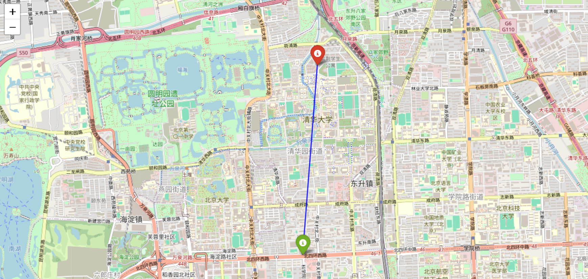
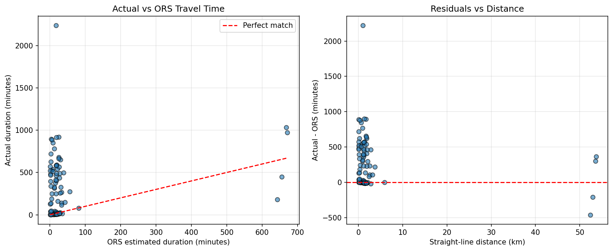

# 🚀 GeoAI for Urban Mobility – Travel Time Prediction from GPS Trajectories


A Python-based pipeline that extracts real travel times from raw GPS trajectories (Microsoft Geolife), compares them with OpenRouteService (ORS) walking estimates, and trains a Random Forest model to predict actual trip duration. The project highlights the importance of stop detection and travel behavior modeling.



---

## 🎯 Objective

Conventional routing APIs assume continuous movement, but real trips include waiting, detours, and idle periods. This project investigates:

- How well do ORS walking estimates match actual travel times?
- Can a simple machine learning model predict actual duration using only temporal and distance features?
- What does the prediction error reveal about missing factors (e.g., stops)?

---

## 📂 Dataset

- **Source:** Microsoft Geolife GPS trajectory dataset (182 users, 17,621 trajectories)
- **Extracted trips:** 45+ trips with valid start/end points and timestamps
- **Trip selection:** First 50 `.plt` files from user `000` (Beijing area), filtered for completeness

---

## ⚙️ Pipeline Overview

1. **Load and parse** each `.plt` file (skip header, extract latitude, longitude, date, time)
2. **Calculate actual travel time** from timestamps (end – start) in minutes
3. **Call ORS API** for the same start/end coordinates to get driving estimate
4. **Feature engineering**
   - Hour of day  
   - Day of week  
   - Straight-line distance (km)  
5. **Train Random Forest model** to predict actual duration
6. **Evaluate performance** using MAE and compare with baseline (mean prediction)

---

## 📊 Key Results

| Metric | Value |
|--------|-------|
| Number of trips | 96 |
| Actual travel time range |  0.9 – 2238 minutes |
| ORS estimate range | 0.5 – 671 minutes |
| Random Forest MAE | **245.25 minutes** |
| Baseline MAE (predict mean) | **209.83 minutes** |

🚨 **Observation:**  
The model performed worse than the baseline.

Residual analysis showed that **long idle periods (stops > 10 minutes)** dominate actual travel time. ORS assumes continuous walking, leading to systematic underestimation.

---

## 📍 Example Trip (Trip #1)

| Field | Value |
|-------|-------|
| Start | (39.984702, 116.318417) |
| End | (40.009328, 116.320887) |
| Straight-line distance | 2.75 km |
| Actual duration | 498 minutes (8.3 hours) |
| ORS walking estimate | 38.7 minutes |
| Difference | +459 minutes |

The GPS trace clearly shows extended stopping periods (e.g., resting, shopping, waiting), which explains the massive discrepancy.



---

## 🧱 Code Structure

```text
├── batch_process_trips.py   # Process .plt files, call ORS, save dataset
├── train_model.py           # Train Random Forest, evaluate, plot residuals
├── test_one_trip.py         # Debug script for a single trajectory
├── data/                    # Geolife dataset (not included)
└── trip_data.csv            # Generated dataset (features + durations)
```

---

## 🚀 How to Run

### 1. Download Dataset
Download the Geolife dataset from Microsoft Research and extract into the `data/` directory.

### 2. Install Dependencies
```bash
pip install pandas requests scikit-learn numpy
```

### 3. Set ORS API Key
Replace:
```python
YOUR_ORS_API_KEY
```
inside `batch_process_trips.py`.

### 4. Run Batch Processing
```bash
python batch_process_trips.py
```

### 5. Train the Model
```bash
python train_model.py
```

---

## 🧠 Key Findings & Interpretation

- ORS walking estimates model **movement only**, not real-world delays  
- Random Forest fails due to **missing behavioral features (stops)**  
- Travel time prediction requires **trajectory segmentation (move vs idle)**  

👉 Core insight:  
**Stop detection is essential for realistic urban mobility modeling**

---

## 🔮 Future Work

- Implement **stop detection** (e.g., DBSCAN on time-clustered GPS points)  
- Develop a **two-stage model**:
  - Stop classification  
  - Duration prediction  
- Apply **map matching** to align GPS with road networks  
- Scale to full dataset (182 users)  
- Explore **deep learning models (LSTM / sequence models)**  

---

## 🙌 Credits

- Microsoft Geolife dataset (Zheng et al.)
- OpenRouteService (ORS) for routing estimates
- scikit-learn for machine learning

---

## 📜 License

MIT License – for educational and research purposes